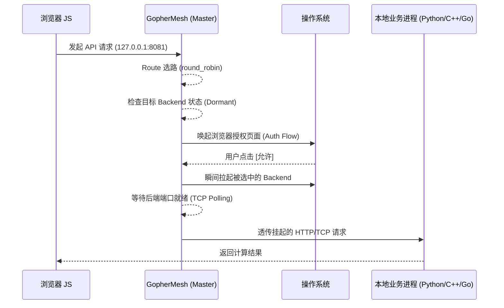

# GopherMesh 🐹

> **Burrowing through the Sandbox: A High-Performance, Scale-to-Zero Local Edge Proxy.**

[](https://goreportcard.com/report/github.com/xingchen/gophermesh)
[](https://opensource.org/licenses/MIT)

**GopherMesh** 是一套极其轻量、跨平台的本地边缘计算基础设施。它旨在打破浏览器沙盒（Browser Sandbox）与操作系统原生算力（Native OS Capability）之间的物理隔阂，为现代 Web 应用提供“零延迟、高权限、自动化”的本地算力调度能力。

与其说它是一个工具，不如说它是一个 **“善意的特洛伊木马”** ：它静默地驻留在底层，仅在网页需要调用本地高性能算力（如 Python AI 推理、C++ 图像处理、硬件串口通信）时，才按需唤醒并透明转发流量。

---

## 核心特性 (Key Features)

* **⚡ 缩容至零 (Scale-to-Zero):** 采用按请求/连接触发的冷启动（Cold Start）逻辑。后台业务进程在无流量时不占任何内存，只有被选中的后端才会在请求真正到达时被拉起。
* **🔀 路由级负载均衡 (Route + []Backend):** 一个对外端口可挂载多个后端实例，当前内置简单的 `round_robin` 轮询策略，适合本地多进程分流。
* **🌐 L7 HTTP / L4 TCP 双栈代理:** 默认提供 L7 HTTP 透明反向代理，也支持通过 `protocol: "tcp"` 开启 L4 TCP 字节流透传。
* **🛡️ 浏览器原生授权 (Browser-as-UI):** 摒弃臃肿的 CGO 或 GUI 库。当需要高危操作权限时，GopherMesh 会自动唤起系统默认浏览器弹出授权页面。
* **🔌 依赖倒置架构 (Dependency Inversion):** 既可以作为独立守护进程运行，也可以作为 `Go SDK` 被反向编译进业务代码中。
* **📦 零依赖分发 (Zero-CGO & Static):** 纯 Go 实现，无 CGO 依赖，支持 Windows/macOS/Linux 一键跨平台静态编译，单个二进制文件分发。
* **🌀 环路保护 (Loop Prevention):** 内置健康检查重定向逻辑，彻底杜绝代理配置导致的无限消息循环风暴。
* **🔒 透明 CORS 注入:** 自动拦截并注入 `Access-Control-Allow-Origin: *`，让任何网页前端都能无感调用本地接口。

---

## 架构原理 (Architecture)



---

## 快速开始 (Quick Start)

### 1. 配置 `config.json`

在程序根目录下创建配置文件：

```json
{
  "dashboard_port": "9999",
  "routes": {
    "8081": {
      "name": "Bayesian-Optimizer",
      "load_balance": "round_robin",
      "backends": [
        {
          "name": "optimizer-a",
          "cmd": "python",
          "args": ["opt.py", "--port", "9081"],
          "internal_port": "9081"
        },
        {
          "name": "optimizer-b",
          "cmd": "python",
          "args": ["opt.py", "--port", "9082"],
          "internal_port": "9082"
        }
      ]
    },
    "8082": {
      "name": "Internal-Healthcheck",
      "backends": [
        {
          "name": "dashboard",
          "cmd": "internal",
          "internal_port": "9999"
        }
      ]
    }
  }
}

```

说明：

- `routes` 的 key 是对外暴露端口。
- 每个 `route` 可以挂多个 `backends`，默认使用 `round_robin`。
- 默认协议为 HTTP；若要启用 L4 透传，可设置 `protocol: "tcp"`。
- 冷启动仍然是 serverless 风格，但粒度已经下沉到“本次请求选中的 backend”。

### 2. 启动主进程

```bash
go run . -config config.json
```

也可以直接运行样例配置：

```bash
go run . -config sample/sample_config.json
```

---

## 为什么 DIY 这个项目？

在量化交易与工业物联网（IoT）领域，我们经常面临“Web 界面太弱、云端算力太贵/太远”的尴尬。现有的方案要么过于沉重（Electron），要么极其繁琐（Native Messaging）。

**GopherMesh** 追求的是一种极客式的平衡：**底层极度硬核（Go/Syscall），表层极度轻盈（HTML5），分发极度简单。** 它是为了那些在深夜里，依然追求极致系统掌控感的开发者而生的。


---

## 许可证 (License)

[MIT License](https://www.google.com/search?q=LICENSE)

---

© 2026 Starry Intelligence Technology Limited. Built with hard-coded passion.
